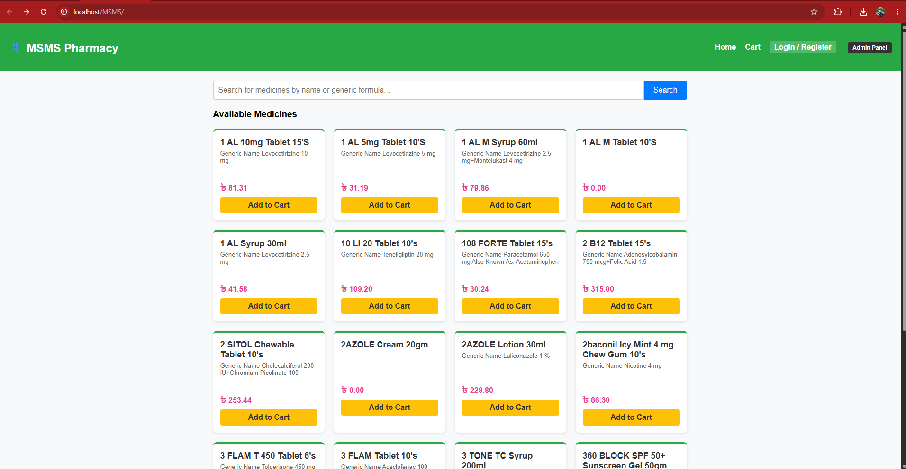
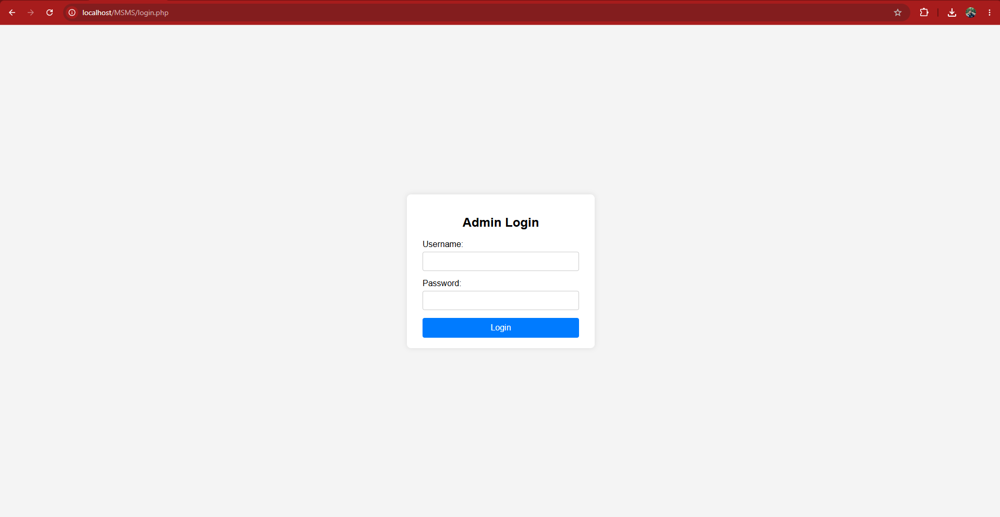
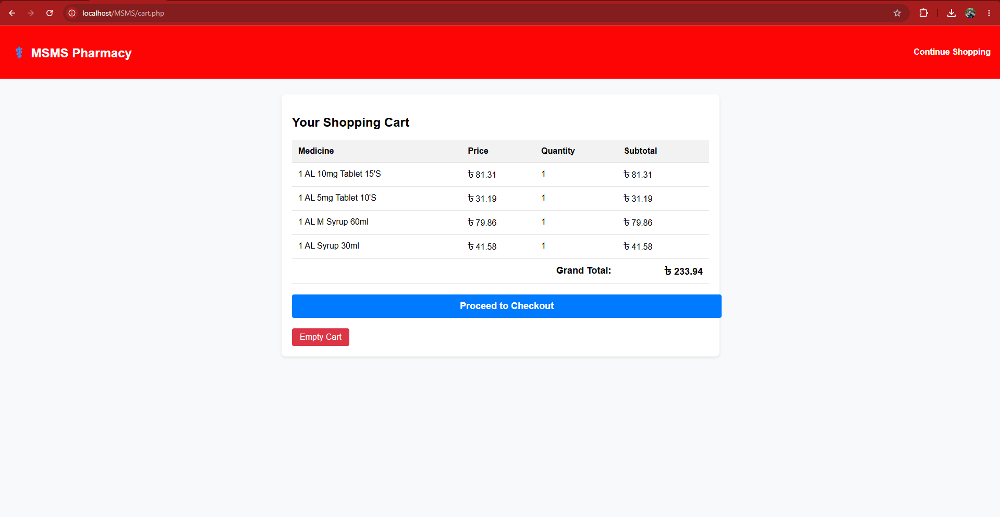

<h1 align="center"> Medicine Shop Management System (MSMS) </h1>
<p align="center"> A complete e-commerce and inventory management system built with PHP and MySQL. </p>

## 📚 Features

- **Admin Panel:**
  - Secure Login/Logout
  - Add, Edit, and Remove Medicines
  - Manage Medicine Categories
  - View and Update Customer Order Statuses
  - View individual Order Details and Prescriptions
- **User/Customer Panel:**
  - Customer Registration and Authentication
  - Search and Filter Medicines by Name or Generic Formula
  - Shopping Cart functionality using PHP Sessions
  - Secure Checkout with Prescription Image Uploads
  - Customer Profile Dashboard with Order History tracking

## 🌲 Project Tree
```bash
├── [MSMS]
│   ├── [includes]
│   │   └── connection.php
│   ├── [uploads]
│   ├── addtocart.php
│   ├── cart.php
│   ├── cart_clear.php
│   ├── category_add.php
│   ├── category_view.php
│   ├── checkout.php
│   ├── checkout_process.php
│   ├── index.php
│   ├── login.php
│   ├── login_process.php
│   ├── logout.php
│   ├── medicine_add.php
│   ├── medicine_edit.php
│   ├── medicine_view.php
│   ├── order_details.php
│   ├── order_view.php
│   ├── process_category_add.php
│   ├── process_category_del.php
│   ├── process_medicine_add.php
│   ├── process_medicine_del.php
│   ├── process_medicine_edit.php
│   ├── process_order_status.php
│   ├── register.php
│   ├── register_process.php
│   ├── user_login.php
│   ├── user_login_process.php
│   ├── user_logout.php
│   └── user_profile.php

⚡ Run Locally
Clone the project:

Bash
git clone [https://github.com/rafatistiak/MSMS.git](https://github.com/rafatistiak/MSMS.git)
Place the MSMS folder inside your xampp/htdocs directory.

Start XAMPP (Apache and MySQL).

Go to http://localhost/phpmyadmin and create a database named MSMS.

Import your database SQL file to generate the tables.

Access the site at http://localhost/MSMS.

Default Admin Credentials:

Username: admin

Password: admin123

## 📸 Project Screenshots

### Customer Storefront


### Admin Order Management


### Secure Checkout & Prescription Upload
